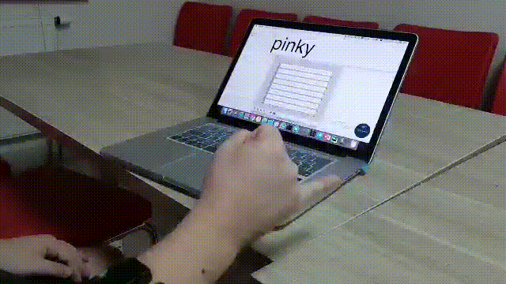

# EMG in gaming applications
For this project we are using MYO armband to get raw EMG data from the forearm's
muscles. 
## Gesture recognition
For now we are able to identify 5 gestures: 
1. Wave left
2. Wave right
3. Clenched fist
4. Pinky finger
5. Relaxed




The gesture recognition is done real-time using LDA classifier. The gesture is then mapped to a specific keyboard input and can be used in a game.

```json
{
  "classes": {
    "1" : "palm_left",
    "2" : "palm_right",
    "3" : "palm_rest",
    "4" : "fist",
    "5" : "pinky"
  },
  "bindings": {
    "1" : "left",
    "2" : "right",
    "3" : "",
    "4" : "",
    "5" : ""
  }
}
```


## Continuous output
For continuous output from the MYO we are using Kernel Ridge Regression with an RBF kernel. The training data was obtained by recording periodic palm movements from left to right. The y-values were obtained from the sine wave that was fitted over the dataset’s peaks.


